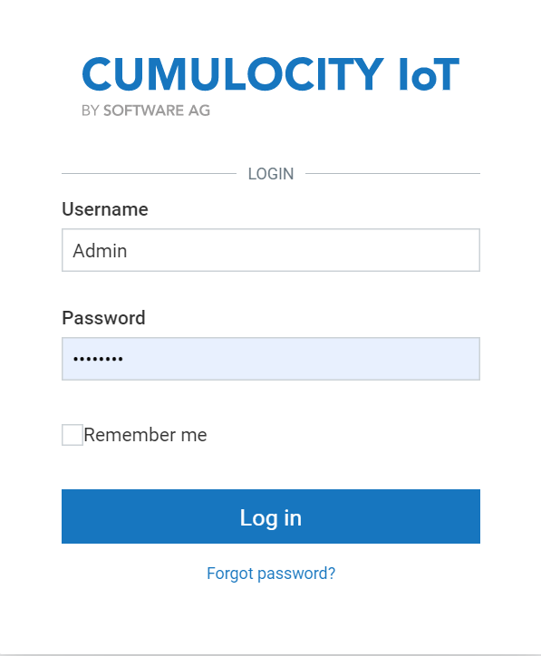

# Introduction to Cumulocity IoT platform

## Overview

The instructions below explain how a user can **_log-in_** to the Cumulocity IoT platform and also use **_Edit user dialog_** functionality.

## Accessing Cumulocity IoT platform 
You can access the Cumulocity IoT platform by desktop and mobile web browsers.

The supported **_desktop_** web browsers
- Google Chrome (latest version)
- Firefox (latest version)
- Internet Explorer (latest version)
- Edge (latest version)

The supported **_mobile_** web browsers
- Safari on iOS 
- Chrome on iOS and Android

**Note:** The _user experience varies_ based on the screen resolution and other factors such as memory and CPU.

## Logging into Cumulocity IoT platform

Enter your _login credentials_ and click on _Login_ button to enter the Cumulocity IoT platform

**_Note:_** 
- Username is case sensitive
- Select the "Remember me" checkbox if you want to save the user credentials on the browser. Selecting the "Remember me" checkbox helps the application to log in automatically the next time. 

After successful login, you will be redirected to _Cockpit_ - the Cumulocity IoT platform.

## User Settings 

To change user-specific details 

1. Click on the User button on the top right corner 
2. Click on User settings to edit or change the user details 

A pop-up dialog box **_Edit user_** appears on the browser 

### Updating user details

The below fields can be changed in the Edit user dialog box

- Login alias
- Email 
- First Name   
- Last Name   
- Telephone    

  **_Note:_** International phone number required, in the format +49 9 876 543 210.
- Language

  **_Note:_** The list of available languages to choose are:

   - English (default)  
   - Deutsch  
   - Spanish  
   - French  
   - Korean  
   - Japanese  
   - Polish  
   - Brazilian Portuguese  
   - Russian  
   - Chinese   
 

## Changing password

The below steps explains how the user can reset the password 

1. Click on the User button on the top right corner 
2. Click on User settings 
3. Click on the Change password button under Login options
4. Enter the new password

* **Note:** The password must have atleast 8 characters and no more than 32.
Password Strength Indicator will display how strong is your password.

There are three indicators **_weak_**, **_medium_** and **_strong_**.
**_Strong_** password is when you have the password with combinations of uppercase, lowecase, numbers and special characters. 

5. Re-enter the password 
6. Click on Save to save your new password.

